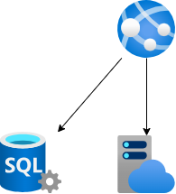

# trykle-web
Water management controller Web app



# Setup

Configure the environment variables. Copy `example.env` to `.env` and update the values

```bash
# Load environment variables
source ./script/common.sh
load_env .env

# Create Core Infrastructure
./script/devops.sh provision
```

# Development

You'll need to set up a development environment if you want to develop a new feature or fix issues.

The project uses a docker based devcontainer to ensure a consistent development environment. 
- Open the project in VSCode and it will prompt you to open the project in a devcontainer. This will have all the required tools installed and configured.


## Setup local dev environment

If you want to develop outside of a docker devcontainer you can use the following commands to setup your environment.


Setup Python Requirements

```bash
# Create and activate a python virtual environment
# virtualenv \path\to\.venv -p path\to\specific_version_python.exe
python3 -m venv .venv
source .venv/bin/activate
# deactivate

pip install -r requirements_dev.txt

# Configure flask environment variables
# set FLASK_APP=app.py # Windows
export FLASK_APP=app.py
```

Configure linting and formatting tools

```bash
# Install tools
sudo apt-get update
sudo apt-get install -y shellcheck
pre-commit install
```

Configure Azure CLI and authenticate

```bash
# Install azure cli
curl -sL https://aka.ms/InstallAzureCLIDeb | sudo bash

# login to azure cli
az login --tenant $TENANT_ID
```

Initialize the database

```bash
# Install DB Driver on local machine see: https://docs.microsoft.com/en-us/sql/connect/odbc/download-odbc-driver-for-sql-server?redirectedfrom=MSDN&view=sql-server-ver15

# Initialize the database
python ./script/deploy_db.py
```

Run the Web App

```bash
FLASK_APP=app.py FLASK_DEBUG=1 FLASK_RUN_CERT=adhoc flask run
```

Deploy and Run the Web app in cloud

```bash
az webapp up --name trykle
```

## Style Guidelines
This project enforces quite strict [PEP8](https://www.python.org/dev/peps/pep-0008/) and [PEP257 (Docstring Conventions)](https://www.python.org/dev/peps/pep-0257/) compliance on all code submitted.

We use [Black](https://github.com/psf/black) for uncompromised code formatting.

Summary of the most relevant points:

- Comments should be full sentences and end with a period.
- [Imports](https://www.python.org/dev/peps/pep-0008/#imports) should be ordered.
- Constants and the content of lists and dictionaries should be in alphabetical order.
- It is advisable to adjust IDE or editor settings to match those requirements.

### Use new style string formatting

Prefer [f-strings](https://docs.python.org/3/reference/lexical_analysis.html#f-strings) over `%` or `str.format`.

```python
#New
f"{some_value} {some_other_value}"
# Old, wrong
"{} {}".format("New", "style")
"%s %s" % ("Old", "style")
```

One exception is for logging which uses the percentage formatting. This is to avoid formatting the log message when it is suppressed.

```python
_LOGGER.info("Can't connect to the webservice %s at %s", string1, string2)
```

## Testing
As it states in the Style Guidelines section all code is checked to verify the following:

- All the unit tests pass
- All code passes the checks from the linting tools

To run the linters, run the following commands:

```bash
# Use pre-commit scripts to run all linting
pre-commit run --all-files

# Run a specific linter via pre-commit
pre-commit run --all-files codespell

# Or run a specific linter directly
# Check for spelling errors
codespell

# Check for scripting errors
shellcheck ./script/*.sh
```

# References
- Using SqlAlchemy https://medium.com/@anushkamehra16/connecting-to-sql-database-using-sqlalchemy-in-python-2be2cf883f85
